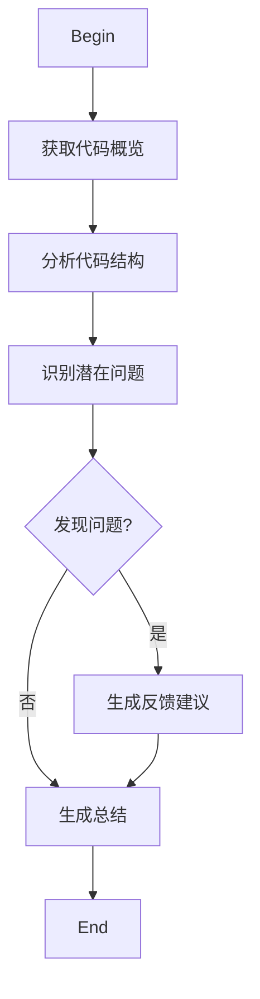

# Code Review Flow

This skill provides a structured workflow for performing code reviews.

## Process

## Stages

1. **获取代码概览** - 理解代码的整体结构和目的
2. **分析代码结构** - 检查代码组织、命名规范、设计模式
3. **识别潜在问题** - 查找bug、性能问题、安全隐患
4. **生成反馈建议** - 提供具体的改进建议（如果发现问题）
5. **生成总结** - 输出完整的代码审查报告

## Decision Points

- `发现问题?` - 如果识别到任何问题，进入反馈生成阶段；否则直接生成总结
